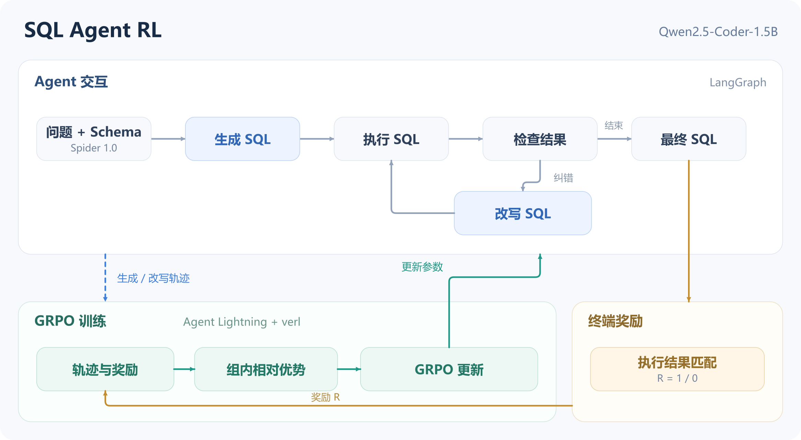

# SQL Agent RL

**基于 GRPO 的多轮 Text-to-SQL Agent 训练优化**

以 **Qwen2.5-Coder-1.5B-Instruct** 为基座，在 **LangGraph** 中组织 SQL 生成、执行、检查与改写，通过 **Agent Lightning + verl** 将生成和改写动作接入同一条 GRPO 在线训练链路。

项目关注两个问题：如何让模型生成更准确的首条 SQL，以及如何让后续改写帮助纠错、减少破坏已经正确的答案。

## 整体方案



[查看矢量图](docs/assets/architecture.svg)

1. **Agent 交互**：模型读取问题和 Schema，生成 SQL；SQLite 返回执行观察，检查节点决定结束或进入改写。每条轨迹最多执行 3 个 SQL 候选。
2. **执行奖励**：在轨迹结束后比较最终 SQL 与参考 SQL 的执行结果，匹配为 1，否则为 0。参考 SQL 仅由评判器读取，不进入模型提示词。
3. **联合策略优化**：选择 `write_query` 与 `rewrite_query` 节点的真实动作，按题次组织相对优势，通过 GRPO 更新共享模型参数。检查节点参与流程，但不直接进入策略损失。
4. **训练实现**：双卡 FSDP、参数与优化器卸载、8 个并行 rollout runner；每个题次采样 4 条完整轨迹，进行全参数在线训练。

具体的数据流、奖励分配与源码阅读顺序见 [方案说明](docs/architecture.md)。

## 数据与配置

使用 [Spider 1.0](https://yale-lily.github.io/spider) 跨数据库 Text-to-SQL 数据集。按数据库划分内部训练和验证集，官方开发集用于最终评估。

| 划分 | 题目数 | 数据库数 |
|---|---:|---:|
| 训练集 | 6,563 | 131 |
| 内部开发集 | 434 | 9 |
| 官方开发集 | 1,034 | 20 |

训练源为 `train_spider.json`；数据准备阶段排除 3 条参考 SQL 无法执行的记录。三个划分的数据库互不重叠，任务输入与参考答案分别保存。

主要配置集中在 [`configs/grpo.json`](configs/grpo.json)：模型学习率 `1e-6`，训练 `2 epochs`，每批 `32` 个题次，prompt/response 上限 `4096/2048 tokens`。8 个 runner 是采样并行度，不是 GRPO 的组大小。

## 结果概览

Spider 官方开发集，1,034 题；相同 Agent 流程与执行判分方式：

| 模型 | 首答执行匹配率 | 多轮最终执行匹配率 |
|---|---:|---:|
| Qwen2.5-Coder-1.5B 基座 | 60.93% | 32.69% |
| GRPO 联合训练模型 | **69.92%** | **73.89%** |

结果对应完整训练末尾的 checkpoint。基座的多轮过程会误改部分正确首答，因此首答与最终指标分别报告。这里的执行匹配不是 SQL 字符串匹配，也不是 Spider 隐藏测试集或官方排行榜成绩。

## 使用方式

先进行不需要 GPU 和训练依赖的配置预览：

```bash
python -m sql_agent_rl.train --dry-run
python -m unittest discover -s tests -v
```

实际使用分为四步：准备 Spider 数据 → 安装固定版本训练环境 → 启动 GRPO → 导出模型。另提供单题 Agent 演示入口。

详细命令见 [运行指南](docs/usage.md)。训练环境为 Linux / Python 3.12 / 双 RTX 4090 24GB，约 120GB 主机内存。仓库只包含代码和配置；数据、权重、运行输出由用户在本地生成。

## 目录

```text
sql-agent-rl/
├── configs/grpo.json          # 一套完整的联合训练配置
├── sql_agent_rl/
│   ├── agent.py               # LangGraph 节点、提示词与任务包装
│   ├── train.py               # GRPO 训练入口
│   ├── config.py              # 配置、任务检查与批次补齐
│   ├── prepare_data.py        # Spider 准备与数据库划分
│   ├── sql_safety.py          # 只读执行、超时和有界结果预览
│   ├── feedback.py            # 执行观察的呈现
│   ├── schema_database.py    # 数据库 Schema 读取
│   ├── evaluation_guard.py   # 终端奖励的执行比较入口
│   ├── spider_eval/           # 复用的 SQL 执行比较器
│   ├── trace_adapter.py       # 训练节点选择与完整动作校验
│   ├── callbacks.py           # 训练指标和 checkpoint 管理
│   ├── demo.py                # 单题演示
│   └── export.py              # FSDP 权重合并导出
├── scripts/                   # 固定版本框架准备、教学数据库生成
├── runtime/                   # 训练框架版本与必要兼容补丁
├── examples/demo.sql          # 小型自建教学数据
├── tests/                     # CPU 功能检查
└── docs/                      # 方案与运行指南
```

## 来源与许可

在 [Microsoft Agent Lightning 的 Spider 示例](https://github.com/microsoft/agent-lightning/tree/6db3c73dc0af2e50fe80e56873a57c1703f1b2a7/examples/spider) 基础上整理开发。沿用其 LangGraph 工作流、提示词、训练框架和 SQL 比较实现；本项目完成数据划分与接入、执行环境约束、生成/改写联合训练配置以及可移植运行入口。

框架和算法分别来自 [Agent Lightning](https://github.com/microsoft/agent-lightning)、[verl](https://github.com/volcengine/verl)；SQL 比较代码保留 [test-suite-sql-eval](https://github.com/taoyds/test-suite-sql-eval) 归属。代码许可与第三方说明见 [LICENSE](LICENSE) 和 [THIRD_PARTY_NOTICES.md](THIRD_PARTY_NOTICES.md)。
